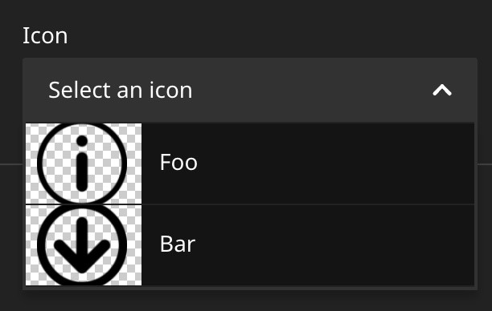

# Neos CMS selectbox editor with preview

This plugin adds a new variant of the Neos selectbox editor that supports `preview` properties on options
and shows those when selecting an items in the selectbox.
                                        
In Neos CMS only the `AssetEditor` and `NodeEditor` have this feature and
it's not possible yet to use this for other data types.

This feature will soon be integrated into Neos CMS and this plugin 
allows to use it for older Neos versions 4.3+.



## Installation

Install the package `shel/neos-previewselectbox` via composer as
dependency of your sitepackage.
                    
## How to use

Instead of setting the `icon` property for each value, you set `preview` to an absolute uri.

### With a datasource

Make sure the datasource returns a `preview` property with an absolute url
for each item returned.

```yaml
'My.Vendor:Content.Something':
  superTypes:
    Neos.Neos:Content: true
  ui:
    label: i18n
  properties:
    icon:
      type: string
      ui:
        label: 'Icon'
        reloadIfChanged: true
        inspector:
          group: icon
          editor: Shel.Neos/PreviewSelectBoxEditor
          editorOptions:
            placeholder: Select an icon
            allowEmpty: true
            dataSourceIdentifier: my-icon-datasource
```

### Without datasource

```yaml
'My.Vendor:Content.Something':
  superTypes:
    Neos.Neos:Content: true
  ui:
    label: i18n
  properties:
    icon:
      type: string
      ui:
        label: 'Icon'
        reloadIfChanged: true
        inspector:
          group: icon
          editor: Shel.Neos/PreviewSelectBoxEditor
          editorOptions:
            placeholder: Select an icon
            allowEmpty: true
            values:
              'foo':
                label: Foo
                preview: https://some.url/my-foo-icon.svg
              'bar':
                label: Bar
                preview: https://some.url/my-bar-icon.svg
```
